

  <picture>
    <source media="(prefers-color-scheme: dark)"
      srcset="https://capsule-render.vercel.app/api?type=waving&color=gradient&customColorList=12&height=120&section=header&text=Nathan%20Heaps&fontSize=32&animation=fadeIn&fontAlignY=30&desc=Staff%20Full-Stack%20DevOps%20Engineer&descSize=14&descAlignY=50&fontColor=fefefe">
    
  </picture>

  
  
  
  

 

  <a href="https://github.com/ryo-ma/github-profile-trophy#readme">
    <picture>
      <source media="(prefers-color-scheme: dark)"
        srcset="https://github-profile-trophy.vercel.app/?username=nsheaps&row=1&column=6&no-frame=true&no-bg=true&theme=darkhub">
      
    </picture>
  </a>

 

  <picture>
    <source media="(prefers-color-scheme: dark)"
      srcset="https://github-readme-stats.vercel.app/api?username=nsheaps&count_private=true&show_icons=true&theme=github_dark&hide_border=true&bg_color=00000000">
    
  </picture>
  &nbsp;
  <picture>
    <source media="(prefers-color-scheme: dark)"
      srcset="https://github-readme-stats.vercel.app/api/top-langs/?username=nsheaps&count_private=true&hide=php&langs_count=8&layout=compact&theme=github_dark&hide_border=true&bg_color=00000000">
    
  </picture>

  <picture>
    <source media="(prefers-color-scheme: dark)"
      srcset="https://github-readme-streak-stats.herokuapp.com/?user=nsheaps&theme=github-dark-blue&hide_border=true&background=00000000">
    
  </picture>

 

  <picture>
    <source media="(prefers-color-scheme: dark)" srcset="cards/claude-usage-dark.svg">
    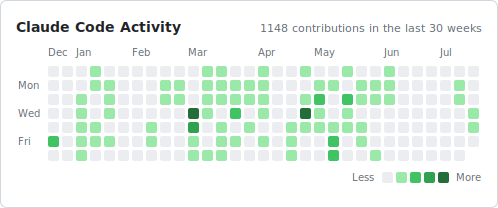
  </picture>

---

## Recent Projects

### Recently Active

  <a href="https://github.com/nsheaps/ai-mktpl">
        <picture>
          <source media="(prefers-color-scheme: dark)" srcset="cards/ai-mktpl-dark.svg">
          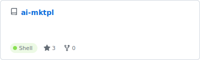
        </picture>
      </a>
  <a href="https://github.com/nsheaps/renovate-config">
        <picture>
          <source media="(prefers-color-scheme: dark)" srcset="cards/renovate-config-dark.svg">
          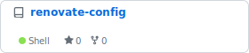
        </picture>
      </a>
  <a href="https://github.com/nsheaps/homebrew-devsetup">
        <picture>
          <source media="(prefers-color-scheme: dark)" srcset="cards/homebrew-devsetup-dark.svg">
          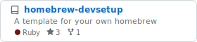
        </picture>
      </a>
  <a href="https://github.com/nsheaps/agents">
        <picture>
          <source media="(prefers-color-scheme: dark)" srcset="cards/agents-dark.svg">
          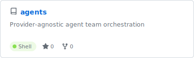
        </picture>
      </a>
  <a href="https://github.com/nsheaps/iac">
        <picture>
          <source media="(prefers-color-scheme: dark)" srcset="cards/iac-dark.svg">
          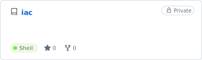
        </picture>
      </a>
  <a href="https://github.com/nsheaps/op-exec">
        <picture>
          <source media="(prefers-color-scheme: dark)" srcset="cards/op-exec-dark.svg">
          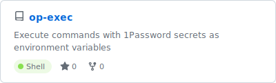
        </picture>
      </a>
  <a href="https://github.com/nsheaps/git-wt">
        <picture>
          <source media="(prefers-color-scheme: dark)" srcset="cards/git-wt-dark.svg">
          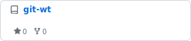
        </picture>
      </a>
  <a href="https://github.com/nsheaps/claude-utils">
        <picture>
          <source media="(prefers-color-scheme: dark)" srcset="cards/claude-utils-dark.svg">
          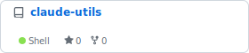
        </picture>
      </a>
  <a href="https://github.com/nsheaps/cept">
        <picture>
          <source media="(prefers-color-scheme: dark)" srcset="cards/cept-dark.svg">
          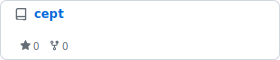
        </picture>
      </a>
  <a href="https://github.com/nsheaps/gh-ext--issue-sync">
        <picture>
          <source media="(prefers-color-scheme: dark)" srcset="cards/gh-ext--issue-sync-dark.svg">
          
        </picture>
      </a>

### AI & Agent Tooling

  <a href="https://github.com/nsheaps/claude-team">
        <picture>
          <source media="(prefers-color-scheme: dark)" srcset="cards/claude-team-dark.svg">
          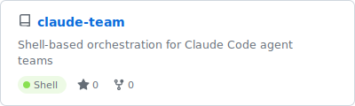
        </picture>
      </a>
  <a href="https://github.com/nsheaps/claude-utils">
        <picture>
          <source media="(prefers-color-scheme: dark)" srcset="cards/claude-utils-dark.svg">
          
        </picture>
      </a>
  <a href="https://github.com/nsheaps/.claude">
        <picture>
          <source media="(prefers-color-scheme: dark)" srcset="cards/.claude-dark.svg">
          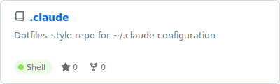
        </picture>
      </a>
  <a href="https://github.com/nsheaps/vscode-claude-log-plugin">
        <picture>
          <source media="(prefers-color-scheme: dark)" srcset="cards/vscode-claude-log-plugin-dark.svg">
          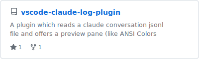
        </picture>
      </a>
  <a href="https://github.com/nsheaps/ai-mktpl">
        <picture>
          <source media="(prefers-color-scheme: dark)" srcset="cards/ai-mktpl-dark.svg">
          
        </picture>
      </a>
  <a href="https://github.com/nsheaps/aitkit">
        <picture>
          <source media="(prefers-color-scheme: dark)" srcset="cards/aitkit-dark.svg">
          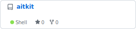
        </picture>
      </a>

### DevOps & Infrastructure

  <a href="https://github.com/nsheaps/iac">
        <picture>
          <source media="(prefers-color-scheme: dark)" srcset="cards/iac-dark.svg">
          
        </picture>
      </a>
  <a href="https://github.com/nsheaps/portainer-stacks">
        <picture>
          <source media="(prefers-color-scheme: dark)" srcset="cards/portainer-stacks-dark.svg">
          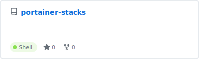
        </picture>
      </a>
  <a href="https://github.com/nsheaps/tiltenv">
        <picture>
          <source media="(prefers-color-scheme: dark)" srcset="cards/tiltenv-dark.svg">
          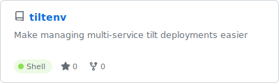
        </picture>
      </a>
  <a href="https://github.com/nsheaps/n8-renovate">
        <picture>
          <source media="(prefers-color-scheme: dark)" srcset="cards/n8-renovate-dark.svg">
          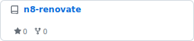
        </picture>
      </a>

### GitHub Actions & Automation

  <a href="https://github.com/nsheaps/github-actions">
        <picture>
          <source media="(prefers-color-scheme: dark)" srcset="cards/github-actions-dark.svg">
          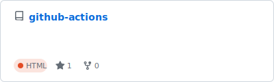
        </picture>
      </a>
  <a href="https://github.com/nsheaps/pull-from-upstream">
        <picture>
          <source media="(prefers-color-scheme: dark)" srcset="cards/pull-from-upstream-dark.svg">
          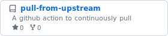
        </picture>
      </a>
  <a href="https://github.com/nsheaps/renovate-config">
        <picture>
          <source media="(prefers-color-scheme: dark)" srcset="cards/renovate-config-dark.svg">
          
        </picture>
      </a>

### Developer Tools

  <a href="https://github.com/nsheaps/private-pages">
        <picture>
          <source media="(prefers-color-scheme: dark)" srcset="cards/private-pages-dark.svg">
          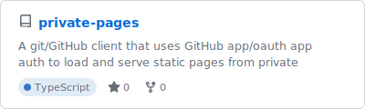
        </picture>
      </a>
  <a href="https://github.com/nsheaps/cors-proxy">
        <picture>
          <source media="(prefers-color-scheme: dark)" srcset="cards/cors-proxy-dark.svg">
          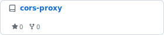
        </picture>
      </a>
  <a href="https://github.com/nsheaps/op-exec">
        <picture>
          <source media="(prefers-color-scheme: dark)" srcset="cards/op-exec-dark.svg">
          
        </picture>
      </a>
  <a href="https://github.com/nsheaps/git-wt">
        <picture>
          <source media="(prefers-color-scheme: dark)" srcset="cards/git-wt-dark.svg">
          
        </picture>
      </a>
  <a href="https://github.com/nsheaps/gs-stack-status">
        <picture>
          <source media="(prefers-color-scheme: dark)" srcset="cards/gs-stack-status-dark.svg">
          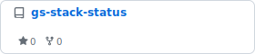
        </picture>
      </a>
  <a href="https://github.com/nsheaps/homebrew-devsetup">
        <picture>
          <source media="(prefers-color-scheme: dark)" srcset="cards/homebrew-devsetup-dark.svg">
          
        </picture>
      </a>
  <a href="https://github.com/nsheaps/dotfiles">
        <picture>
          <source media="(prefers-color-scheme: dark)" srcset="cards/dotfiles-dark.svg">
          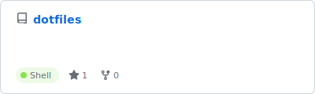
        </picture>
      </a>

### Web & Extensions

  <a href="https://github.com/nsheaps/cept">
        <picture>
          <source media="(prefers-color-scheme: dark)" srcset="cards/cept-dark.svg">
          
        </picture>
      </a>
  <a href="https://github.com/nsheaps/greasemonkey-scripts">
        <picture>
          <source media="(prefers-color-scheme: dark)" srcset="cards/greasemonkey-scripts-dark.svg">
          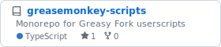
        </picture>
      </a>

### Other Projects

  <a href="https://github.com/nsheaps/agents">
        <picture>
          <source media="(prefers-color-scheme: dark)" srcset="cards/agents-dark.svg">
          
        </picture>
      </a>
  <a href="https://github.com/nsheaps/claude-code-py">
        <picture>
          <source media="(prefers-color-scheme: dark)" srcset="cards/claude-code-py-dark.svg">
          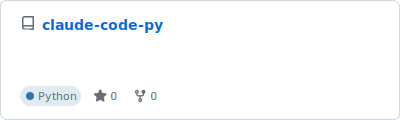
        </picture>
      </a>
  <a href="https://github.com/nsheaps/gh-ext--issue-sync">
        <picture>
          <source media="(prefers-color-scheme: dark)" srcset="cards/gh-ext--issue-sync-dark.svg">
          
        </picture>
      </a>
  <a href="https://github.com/nsheaps/public-scratch">
        <picture>
          <source media="(prefers-color-scheme: dark)" srcset="cards/public-scratch-dark.svg">
          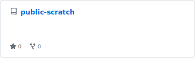
        </picture>
      </a>
  <a href="https://github.com/nsheaps/scratch">
        <picture>
          <source media="(prefers-color-scheme: dark)" srcset="cards/scratch-dark.svg">
          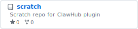
        </picture>
      </a>
  <a href="https://github.com/nsheaps/aifs">
        <picture>
          <source media="(prefers-color-scheme: dark)" srcset="cards/aifs-dark.svg">
          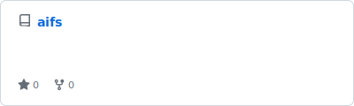
        </picture>
      </a>

---

  <picture>
    <source media="(prefers-color-scheme: dark)"
      srcset="https://capsule-render.vercel.app/api?type=waving&color=gradient&customColorList=12&height=80&section=footer&fontColor=fefefe">
    
  </picture>

